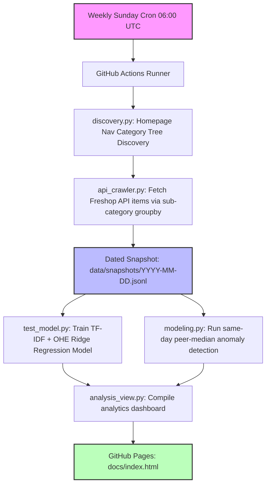

# 🛒 King Kullen Price Research & Pipeline

[](https://www.python.org/)
[](https://github.com/psf/black)
[](https://github.com/frankstop/KingKullenResearch/actions)
[](LICENSE)

An automated, production-grade longitudinal grocery pricing data pipeline and predictive modeling suite. Tracks over **20,000 unique products** across **420+ sub-categories** weekly, using a reverse-engineered Freshop storefront gateway API to build historical snapshots, run regularized regression models, and surface pricing anomalies.

The live analytics dashboard is hosted via **GitHub Pages** at [`docs/index.html`](https://frankstop.github.io/KingKullenResearch/).

---

## 🏛 System Architecture

The entire pipeline is automated using **GitHub Actions** running on a weekly cron cycle. The architecture consists of the dynamic discovery, crawled API ingestion, regularized model fitting, anomaly flagging, and automated analytics compilation stages:



---

## 💎 Project Pillars & Core Modules

The repository's production code is structured into highly cohesive modules:

### 1. Dynamic Discovery & Polite Crawling
- **`grocery_pricing/discovery.py`**: Boots by parsing King Kullen's homepage JSON, dynamically extracting navigation categories and saving them to `categories.json`.
- **`grocery_pricing/api_crawler.py`**: Queries King Kullen's storefront gateway. Leverages a `productCount=1000` query parameter optimization to circumvent the API's standard product-capping limits, downloading complete listings per category with a polite 1.0-second delay.

### 2. Versioned Snapshots (Git-as-a-Database)
- All successful runs output dated, newline-delimited JSON (**JSONL**) catalogs under `data/snapshots/YYYY-MM-DD.jsonl`. This longitudinal historical catalog serves as our training data lake.

### 3. Predictive Machine Learning
- **`scratch/test_model.py`**: Trains our production price regression model. Sets up a scikit-learn `Pipeline` utilizing `ColumnTransformer`:
  - **TF-IDF Vectorizer** (1,000 max features) extracts semantic pricing signals from raw product names (e.g., "organic", "oz").
  - **One-Hot Encoder** maps categorical features from primary category tags.
  - **Ridge Regression** ($L_2$ regularization, $\alpha=1.0$) fits the sparse, high-dimensional space, yielding an $R^2 \approx 0.590$.

### 4. Price Anomaly Detection
- **`grocery_pricing/modeling.py`**: Implements a relative competitor anomaly rule. Grouping price points by day, it computes same-day peer medians and flags promotions falling $25\%$ or more below the median as a `PriceDropAnomaly`.

### 5. Interactive Glass-Box Dashboard
- **`grocery_pricing/analysis_view.py`**: Reads raw snapshot runs and renders `docs/index.html` with category shelf space, price distribution boxplots, discount percentages, and model residual diagnostics.

---

## 🚀 Execution & Command Reference

### Development Setup
To configure your local environment and install the pipeline dependencies in editable mode:
```bash
# Clone the repository
git clone https://github.com/frankstop/KingKullenResearch.git
cd KingKullenResearch

# Install in editable mode
pip install -e .
```

### 1. Ingestion & Crawler Commands
To run the dynamic navigation discovery:
```bash
python3 -m grocery_pricing.discovery
```
To run the polite production crawler (outputs dated snapshot by default):
```bash
python3 -m grocery_pricing.api_crawler
```

### 2. Modeling & Analysis Commands
To fit the Ridge Regression price predictor and print validation $R^2$ scores:
```bash
python3 scratch/test_model.py
```
To compile the glass-box analyst dashboard:
```bash
python3 -m grocery_pricing.analysis_view
```

### 3. Verification & CI Checks
To run the automated unittest suite (reconciliation, Scrapy-style HTML parser fallback, and anomaly flags):
```bash
python3 -m unittest
```
To run static style checks and output directory verification:
```bash
python3 scripts/check.py
```

---

## 🗺 Project Roadmap

*   **Phase 0-2 (Completed):** Build Scrapy-style local parsers, exact UPC reconciliation adapters, and TDD HTML fixture-parsing suites.
*   **Phase 3-4 (Completed):** Implement dynamic category tree discovery, Freshop groupby crawling, Git-as-a-Database snapshots, scikit-learn Ridge modeling, and glass-box metrics dashboards.
*   **Phase 5 (In Progress):** Add predictive model retraining pipelines on historical accumulations, cron automation under Docker, and alert dashboards.

---

## 📄 License
This project is licensed under the MIT License. See [LICENSE](LICENSE) for details.
