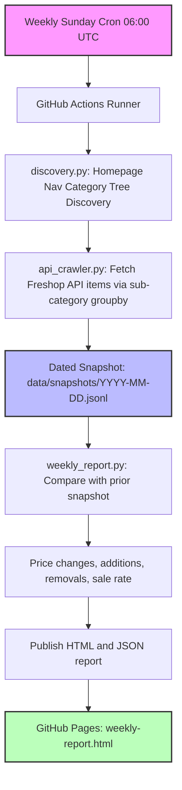

# 🛒 King Kullen Price Research & Pipeline

[](https://www.python.org/)
[](https://github.com/psf/black)
[](https://github.com/frankstop/KingKullenResearch/actions/workflows/weekly_crawl.yml)
[](LICENSE)

An automated longitudinal grocery pricing pipeline. It collects over **20,000 catalog records** representing more than **16,000 unique UPCs** weekly through King Kullen's Freshop storefront gateway API, compares every new snapshot with the prior week, and publishes concrete price movements.

The project overview, [price time series](https://frankstop.github.io/KingKullenResearch/weekly-report.html), and searchable [all-item price history](https://frankiejvaldez.com/projects/kingkullenresearch/catalog-history/) are published through GitHub Pages. The item explorer retains current, missing, and returned UPCs across every snapshot rather than limiting the view to top movers.

See [docs/ARCHITECTURE.md](docs/ARCHITECTURE.md) for the raw → derived → published contracts and failure rules.

---

## 🏛 System Architecture

The production pipeline is automated with **GitHub Actions** on a weekly cron cycle. It separates dynamic discovery and API ingestion from time-series derivation and publication:



---

## 💎 Project Pillars & Core Modules

The repository's production code is structured into highly cohesive modules:

### 1. Dynamic Discovery & Polite Crawling
- **`grocery_pricing/discovery.py`**: Boots by parsing King Kullen's homepage JSON, dynamically extracting navigation categories and saving them to `categories.json`.
- **`grocery_pricing/api_crawler.py`**: Queries King Kullen's storefront gateway. Leverages a `productCount=1000` query parameter optimization to circumvent the API's standard product-capping limits, downloading complete listings per category with a polite 1.0-second delay.

### 2. Versioned Snapshots (Git-as-a-Database)
- All successful runs output dated, newline-delimited JSON (**JSONL**) catalogs under `data/snapshots/YYYY-MM-DD.jsonl`. This longitudinal historical catalog serves as our training data lake.

### 3. Predictive Machine Learning Experiment
- The checked-in model experiment uses a scikit-learn `Pipeline` with `ColumnTransformer`:
  - **TF-IDF Vectorizer** (1,000 max features) extracts semantic pricing signals from raw product names (e.g., "organic", "oz").
  - **One-Hot Encoder** maps categorical features from primary category tags.
  - **Ridge Regression** ($L_2$ regularization, $\alpha=1.0$) fits the sparse, high-dimensional space, yielding an $R^2 \approx 0.590$.

The weekly automation does not currently retrain this model. It is kept separate until automated validation can prove a newly trained model is better.

### 4. Weekly Price Change Report
- **`grocery_pricing/weekly_report.py`**: Compares the latest two snapshots by UPC, calculates price increases and decreases, catalog additions and removals, sale rate, and historical snapshot health.
- It also derives a complete time series across all snapshots, including product count, average price, sale rate, matched coverage, and change counts for every adjacent week.
- Each scheduled run publishes `docs/weekly-report.html` for people and `docs/data/weekly-summary.json` as the stable machine-readable contract for downstream use.
- Publication fails if the newest crawl matches less than 80% of the prior catalog, preventing a partial crawl from silently becoming the new baseline.

### 5. All-Item Catalog History
- **`grocery_pricing/catalog_history.py`** builds the union of every UPC across every dated snapshot.
- The explorer supports name/category/UPC search, status filters, price-range summaries, sparklines, deep-linked item histories, and filtered CSV export.
- Missing weeks are explicit chart gaps; prices are never interpolated or converted to zero.

---

## 🚀 Execution & Command Reference

### Development Setup
To configure your local environment and install the pipeline dependencies in editable mode:
```bash
# Clone the repository
git clone https://github.com/frankstop/KingKullenResearch.git
cd KingKullenResearch

# Install in editable mode
pip install -e .
```

### 1. Ingestion & Crawler Commands
To run the dynamic navigation discovery:
```bash
python3 -m grocery_pricing.discovery
```
To run the polite production crawler (outputs dated snapshot by default):
```bash
python3 -m grocery_pricing.api_crawler
```

### 2. Modeling & Analysis Commands
To fit the Ridge Regression price predictor and print validation $R^2$ scores:
```bash
python3 scratch/test_model.py
```
To compile the glass-box analyst dashboard:
```bash
python3 -m grocery_pricing.analysis_view
```
To generate the current weekly comparison:
```bash
python3 -m grocery_pricing.weekly_report
```

### 3. Verification & CI Checks
To run the automated unittest suite (reconciliation, Scrapy-style HTML parser fallback, and anomaly flags):
```bash
python3 -m unittest
```
To run static style checks and output directory verification:
```bash
python3 scripts/check.py
```

---

## 🗺 Project Roadmap

*   **Phase 0-2 (Completed):** Build Scrapy-style local parsers, exact UPC reconciliation adapters, and TDD HTML fixture-parsing suites.
*   **Phase 3-4 (Completed):** Implement dynamic category tree discovery, Freshop groupby crawling, Git-as-a-Database snapshots, scikit-learn Ridge modeling, and glass-box metrics dashboards.
*   **Phase 5 (In Progress):** Add validated model retraining on historical accumulations and optional alerts for notable weekly movements.

---

## 📄 License
This project is licensed under the MIT License. See [LICENSE](LICENSE) for details.
